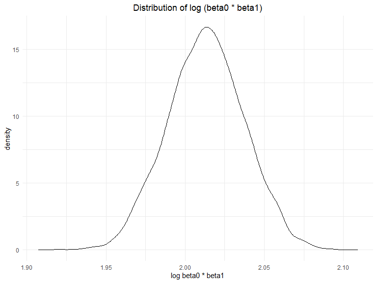
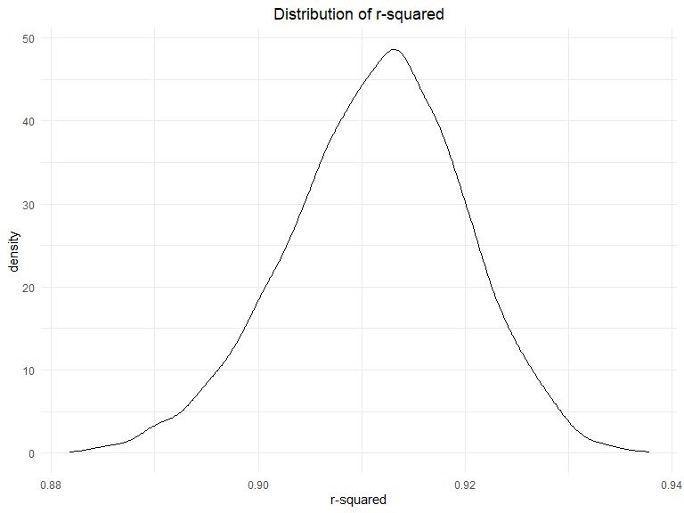
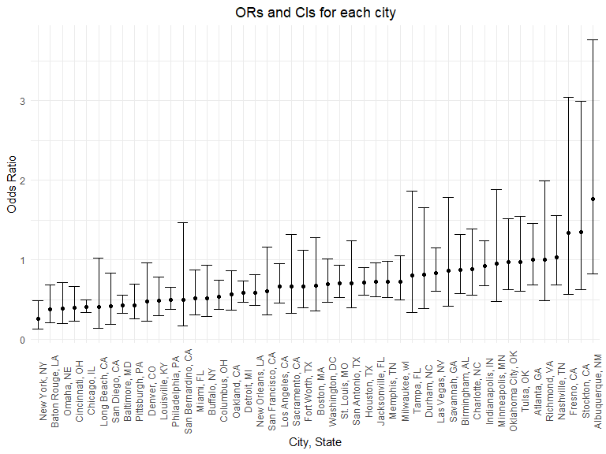
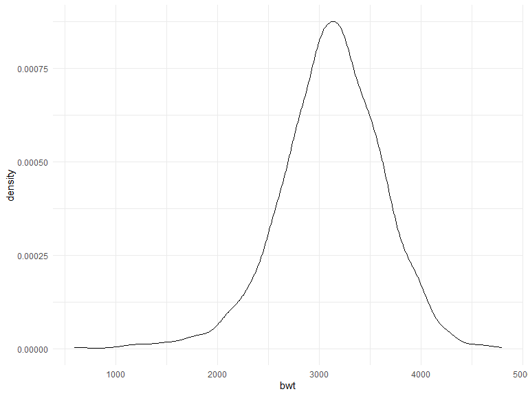
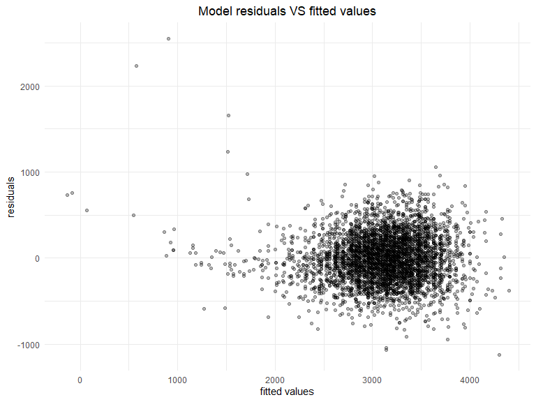
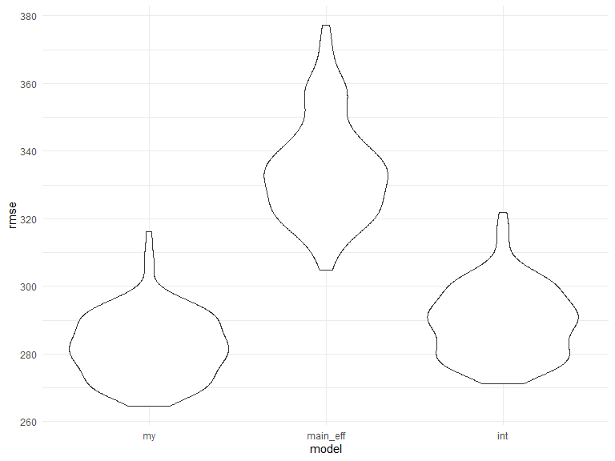

p8105_hw6_yf2605
================

## Problem 1

Download data

``` r
weather_df = 
  rnoaa::meteo_pull_monitors(
    c("USW00094728"),
    var = c("PRCP", "TMIN", "TMAX"), 
    date_min = "2017-01-01",
    date_max = "2017-12-31") %>%
  mutate(
    name = recode(id, USW00094728 = "CentralPark_NY"),
    tmin = tmin / 10,
    tmax = tmax / 10) %>%
  select(name, id, everything())
```

    ## Registered S3 method overwritten by 'hoardr':
    ##   method           from
    ##   print.cache_info httr

    ## using cached file: C:\Users\hzlyz\AppData\Local/Cache/R/noaa_ghcnd/USW00094728.dly

    ## date created (size, mb): 2022-11-26 12:09:42 (8.443)

    ## file min/max dates: 1869-01-01 / 2022-11-30

Function calculates log beta0 \* beta1

``` r
log_betas_fuc = function(model){
  
  estimate_df = 
    broom::tidy(model) %>% 
    select(term, estimate) %>% 
    pivot_wider(
      names_from = term,
      values_from = estimate
    ) %>% 
    janitor::clean_names() %>% 
    mutate(log_betas = log(intercept*tmin))

  estimate_df[["log_betas"]]
}
```

Function gets r squared

``` r
r_squared_fuc = function(model){
  
  r_squared_df = 
    broom::glance(model) %>% 
    janitor::clean_names()

  r_squared_df[["r_squared"]]
}
```

Generate data frame for plot

``` r
models_df =   
  weather_df %>% 
  bootstrap(n = 5000) %>% 
  mutate(
    model = map(strap, ~lm(tmax ~ tmin, data = .x)),
    log_betas = as.numeric(map(model, log_betas_fuc)),
    r_squared = as.numeric(map(model, r_squared_fuc))
  ) %>% 
  select(log_betas, r_squared)
```

### Distribution of log (beta0 \* beta1)

``` r
models_df %>% 
  ggplot(aes(x = log_betas)) +
  geom_density() +
  labs(
    title = "Distribution of log (beta0 * beta1)",
    x = "log beta0 * beta1",
  )
```



The distribution of log (beta0 \* beta1) is approximately normal with
mean about 2.01.

### Distribution of r-squared

``` r
models_df %>% 
  ggplot(aes(x = r_squared)) +
  geom_density() +
  labs(
    title = "Distribution of r-squared",
    x = "r-squared",
  )
```



The distribution of r-squared is approximately normal with mean about
0.912.

### 95% confidence interval

``` r
log_betas_ci = quantile(models_df[["log_betas"]], probs = c(0.025, 0.975))

r_squared_ci = quantile(models_df[["r_squared"]], probs = c(0.025, 0.975))
```

The 95% CI for log (beta0 \* beta1) is (1.9664241, 2.0597217)

The 95% CI for r-squared is (0.8939004, 0.9273358)

## Problem 2

- Create a city_state variable
- Create a binary variable indicating whether the homicide is solved
- Omit cities Dallas, TX; Phoenix, AZ; Kansas City, MO;Tulsa, AL
- filter victim_race white or black.
- convert victim_age to numeric, unknown is converted to NA

``` r
homicide = 
  read_csv("data/homicide-data.csv") %>% 
  mutate(
    city_state = str_c(city, ", ", state),
    solved = ifelse(disposition == "Closed without arrest" | 
                     disposition == "Open/No arrest", 0, 1),
    victim_age = as.numeric(victim_age)
  ) %>% 
  filter(!(city_state %in% c("Dallas, TX", 
                             "Phoenix, AZ", 
                             "Kansas City, MO", 
                             "Tulsa, AL"))) %>% 
  filter(victim_race %in% c("White", "Black"))
```

    ## Rows: 52179 Columns: 12
    ## ── Column specification ────────────────────────────────────────────────────────
    ## Delimiter: ","
    ## chr (9): uid, victim_last, victim_first, victim_race, victim_age, victim_sex...
    ## dbl (3): reported_date, lat, lon
    ## 
    ## ℹ Use `spec()` to retrieve the full column specification for this data.
    ## ℹ Specify the column types or set `show_col_types = FALSE` to quiet this message.

**For the city of Baltimore, MD, use the glm function to fit a logistic
regression with resolved vs unresolved as the outcome and victim age,
sex and race as predictors. Save the output of glm as an R object;apply
the broom::tidy to this object;and obtain the estimate and confidence
interval of the adjusted odds ratio for solving homicides comparing male
victims to female victims keeping all other variables fixed.**

``` r
baltimore_data = homicide %>% 
  filter(city_state == "Baltimore, MD") 

baltimore_logistic = glm(
  solved ~ victim_age + victim_sex + victim_race,
  family=binomial(link='logit'), 
  data = baltimore_data
  )

baltimore_est = 
  broom::tidy(baltimore_logistic, conf.int = TRUE) %>% 
  mutate(
    odds_ratio = exp(estimate),
    low = exp(conf.low),
    high = exp(conf.high)
  ) %>% 
  filter(term == "victim_sexMale") %>% 
  select(odds_ratio, low, high)
```

The adjusted odds ratio for solving homicides comparing male victims to
female victims keeping all other variables fixed is estimated to be
0.4255117, with 95% confidence interval (0.3241908, 0.5575508)

**Now run glm for each of the cities in your dataset, and extract the
adjusted odds ratio (and CI) for solving homicides comparing male
victims to female victims. Do this within a “tidy” pipeline, making use
of purrr::map, list columns, and unnest as necessary to create a
dataframe with estimated ORs and CIs for each city.**

``` r
odds_ratio_fuc = function(model){
  
  df = 
    broom::tidy(model, conf.int = TRUE) %>% 
    mutate(
      odds_ratio = exp(estimate),
      low = exp(conf.low),
      high = exp(conf.high)
    ) %>% 
    filter(term == "victim_sexMale") %>% 
    select(odds_ratio, low, high)

  df
}  

victim_sex_est = 
  homicide %>% 
  select(solved, victim_age, victim_sex, victim_race, city_state) %>% 
  nest(data = c(solved, victim_age, victim_sex, victim_race)) %>% 
  mutate(
    model  = map(data, ~glm(solved ~ victim_age + victim_sex + victim_race, 
                            family=binomial(link='logit'),
                            data = .x)),
    odds_ratios = map(model, odds_ratio_fuc)
  ) %>% 
  unnest(odds_ratios) %>% 
  select(-model, -data)

victim_sex_est
```

    ## # A tibble: 47 × 4
    ##    city_state      odds_ratio   low  high
    ##    <chr>                <dbl> <dbl> <dbl>
    ##  1 Albuquerque, NM      1.77  0.825 3.76 
    ##  2 Atlanta, GA          1.00  0.680 1.46 
    ##  3 Baltimore, MD        0.426 0.324 0.558
    ##  4 Baton Rouge, LA      0.381 0.204 0.684
    ##  5 Birmingham, AL       0.870 0.571 1.31 
    ##  6 Boston, MA           0.674 0.353 1.28 
    ##  7 Buffalo, NY          0.521 0.288 0.936
    ##  8 Charlotte, NC        0.884 0.551 1.39 
    ##  9 Chicago, IL          0.410 0.336 0.501
    ## 10 Cincinnati, OH       0.400 0.231 0.667
    ## # … with 37 more rows

**Create a plot that shows the estimated ORs and CIs for each city.
Organize cities according to estimated OR, and comment on the plot.**

``` r
victim_sex_est %>% 
  mutate(city_state = fct_reorder(city_state, odds_ratio)) %>% 
  ggplot(aes(x = city_state, y=odds_ratio)) +
  geom_point() +
  geom_errorbar(aes(ymin = low, 
                    ymax = high
                  ))+
  labs(
    title = "ORs and CIs for each city",
    y = "Odds Ratio",
    x = "City, State"
  )+
  theme(axis.text.x = element_text(angle = 90))
```



- Most cities have an adjusted odds ratio for solving homicides
  comparing male victims to female victims lower than 1.
- Odds ratio higher than 1 are all non-significant.

## Problem 3

- babysex: baby’s sex (male = 1, female = 2)
- bhead: baby’s head circumference at birth (centimeters)
- blength: baby’s length at birth (centimeteres)
- bwt: baby’s birth weight (grams)
- delwt: mother’s weight at delivery (pounds)
- fincome: family monthly income (in hundreds, rounded)
- frace: father’s race (1 = White, 2 = Black, 3 = Asian, 4 = Puerto
  Rican, 8 = Other, 9 = Unknown)
- gaweeks: gestational age in weeks
- malform: presence of malformations that could affect weight (0 =
  absent, 1 = present)
- menarche: mother’s age at menarche (years)
- mheigth: mother’s height (inches)
- momage: mother’s age at delivery (years)
- mrace: mother’s race (1 = White, 2 = Black, 3 = Asian, 4 = Puerto
  Rican, 8 = Other)
- parity: number of live births prior to this pregnancy
- pnumlbw: previous number of low birth weight babies
- pnumgsa: number of prior small for gestational age babies
- ppbmi: mother’s pre-pregnancy BMI
- ppwt: mother’s pre-pregnancy weight (pounds)
- smoken: average number of cigarettes smoked per day during pregnancy
- wtgain: mother’s weight gain during pregnancy (pounds)

**Load and clean the data for regression analysis (i.e. convert numeric
to factor where appropriate, check for missing data, etc.).**

``` r
birthweight = 
  read_csv("data/birthweight.csv") %>% 
  mutate(
    babysex = recode_factor(babysex, '1' = "male", '2' = "female"),
    frace = recode_factor(frace, '1' = "White", '2' = "Black", '3' = "Asian", 
                          '4' = "Puerto Rican", '8' = "Other", '9' = "Unknown"),
    malform = recode_factor(malform, '0' = "absent", '1' = "present"),
    mrace = recode_factor(mrace, '1' = "White", '2' = "Black", '3' = "Asian", 
                          '4' = "Puerto Rican", '8' = "Other", '9' = "Unknown")
  )
```

    ## Rows: 4342 Columns: 20
    ## ── Column specification ────────────────────────────────────────────────────────
    ## Delimiter: ","
    ## dbl (20): babysex, bhead, blength, bwt, delwt, fincome, frace, gaweeks, malf...
    ## 
    ## ℹ Use `spec()` to retrieve the full column specification for this data.
    ## ℹ Specify the column types or set `show_col_types = FALSE` to quiet this message.

``` r
summary(birthweight)
```

    ##    babysex         bhead          blength           bwt           delwt      
    ##  male  :2230   Min.   :21.00   Min.   :20.00   Min.   : 595   Min.   : 86.0  
    ##  female:2112   1st Qu.:33.00   1st Qu.:48.00   1st Qu.:2807   1st Qu.:131.0  
    ##                Median :34.00   Median :50.00   Median :3132   Median :143.0  
    ##                Mean   :33.65   Mean   :49.75   Mean   :3114   Mean   :145.6  
    ##                3rd Qu.:35.00   3rd Qu.:51.00   3rd Qu.:3459   3rd Qu.:157.0  
    ##                Max.   :41.00   Max.   :63.00   Max.   :4791   Max.   :334.0  
    ##     fincome               frace         gaweeks         malform    
    ##  Min.   : 0.00   White       :2123   Min.   :17.70   absent :4327  
    ##  1st Qu.:25.00   Black       :1911   1st Qu.:38.30   present:  15  
    ##  Median :35.00   Asian       :  46   Median :39.90                 
    ##  Mean   :44.11   Puerto Rican: 248   Mean   :39.43                 
    ##  3rd Qu.:65.00   Other       :  14   3rd Qu.:41.10                 
    ##  Max.   :96.00                       Max.   :51.30                 
    ##     menarche        mheight          momage              mrace     
    ##  Min.   : 0.00   Min.   :48.00   Min.   :12.0   White       :2147  
    ##  1st Qu.:12.00   1st Qu.:62.00   1st Qu.:18.0   Black       :1909  
    ##  Median :12.00   Median :63.00   Median :20.0   Asian       :  43  
    ##  Mean   :12.51   Mean   :63.49   Mean   :20.3   Puerto Rican: 243  
    ##  3rd Qu.:13.00   3rd Qu.:65.00   3rd Qu.:22.0                      
    ##  Max.   :19.00   Max.   :77.00   Max.   :44.0                      
    ##      parity            pnumlbw     pnumsga      ppbmi            ppwt      
    ##  Min.   :0.000000   Min.   :0   Min.   :0   Min.   :13.07   Min.   : 70.0  
    ##  1st Qu.:0.000000   1st Qu.:0   1st Qu.:0   1st Qu.:19.53   1st Qu.:110.0  
    ##  Median :0.000000   Median :0   Median :0   Median :21.03   Median :120.0  
    ##  Mean   :0.002303   Mean   :0   Mean   :0   Mean   :21.57   Mean   :123.5  
    ##  3rd Qu.:0.000000   3rd Qu.:0   3rd Qu.:0   3rd Qu.:22.91   3rd Qu.:134.0  
    ##  Max.   :6.000000   Max.   :0   Max.   :0   Max.   :46.10   Max.   :287.0  
    ##      smoken           wtgain      
    ##  Min.   : 0.000   Min.   :-46.00  
    ##  1st Qu.: 0.000   1st Qu.: 15.00  
    ##  Median : 0.000   Median : 22.00  
    ##  Mean   : 4.145   Mean   : 22.08  
    ##  3rd Qu.: 5.000   3rd Qu.: 28.00  
    ##  Max.   :60.000   Max.   : 89.00

- set babysex, frace, mrace, malform to factor
- no missing data

**Propose a regression model for birthweight. This model may be based on
a hypothesized structure for the factors that underly birthweight, on a
data-driven model-building process, or a combination of the two.
Describe your modeling process and show a plot of model residuals
against fitted values – use add_predictions and add_residuals in making
this plot.**

Variable pnumlbw and pnumsga are 0 for all records and excluded from
model.

``` r
ggplot(birthweight, aes(x =bwt)) + 
  geom_density()
```



The birth weight is continuous and normally distributed, choose linear
regression model

``` r
birthweight %>%
  select_if(is.numeric) %>% 
  select(-pnumlbw, -pnumsga) %>% 
  as.matrix() %>%
  cor()
```

    ##                 bhead     blength          bwt        delwt      fincome
    ## bhead     1.000000000  0.63045480  0.747106776  0.214370719  0.115699146
    ## blength   0.630454800  1.00000000  0.743450753  0.229149444  0.078745057
    ## bwt       0.747106776  0.74345075  1.000000000  0.287889306  0.154571511
    ## delwt     0.214370719  0.22914944  0.287889306  1.000000000  0.034994354
    ## fincome   0.115699146  0.07874506  0.154571511  0.034994354  1.000000000
    ## gaweeks   0.378456488  0.35926367  0.412183348  0.124278465  0.106677673
    ## menarche -0.003016051 -0.02106739 -0.024424664 -0.085940103 -0.003535085
    ## mheight   0.116948174  0.16025985  0.192163204  0.411257622  0.131018596
    ## momage    0.108081296  0.08016031  0.135773400  0.074040925  0.323114207
    ## parity   -0.020039523 -0.03247008 -0.008374112 -0.004709123 -0.025942406
    ## ppbmi     0.086556495  0.07401577  0.093945729  0.720504055 -0.020189000
    ## ppwt      0.136608829  0.14860464  0.182891964  0.870913274  0.047252637
    ## smoken   -0.053947231 -0.06562883 -0.075627807  0.048612734  0.077943047
    ## wtgain    0.183333740  0.19122376  0.247252588  0.424788310 -0.016037706
    ##                gaweeks      menarche     mheight      momage       parity
    ## bhead     0.3784564882 -0.0030160515  0.11694817  0.10808130 -0.020039523
    ## blength   0.3592636747 -0.0210673863  0.16025985  0.08016031 -0.032470081
    ## bwt       0.4121833483 -0.0244246642  0.19216320  0.13577340 -0.008374112
    ## delwt     0.1242784648 -0.0859401032  0.41125762  0.07404092 -0.004709123
    ## fincome   0.1066776727 -0.0035350852  0.13101860  0.32311421 -0.025942406
    ## gaweeks   1.0000000000 -0.0004362693  0.06213774  0.11390983 -0.079658854
    ## menarche -0.0004362693  1.0000000000  0.07411557  0.17603797  0.019476194
    ## mheight   0.0621377387  0.0741155687  1.00000000  0.10904804 -0.013423739
    ## momage    0.1139098271  0.1760379749  0.10904804  1.00000000  0.051954243
    ## parity   -0.0796588545  0.0194761938 -0.01342374  0.05195424  1.000000000
    ## ppbmi     0.0273358740 -0.1218260802 -0.10073775  0.08124512 -0.005926674
    ## ppwt      0.0564730379 -0.0704995875  0.42668724  0.12959210 -0.011202947
    ## smoken    0.0362116820  0.0163746450  0.06098352  0.07545435 -0.005575698
    ## wtgain    0.1481459581 -0.0445137226  0.04847893 -0.08848760  0.011081927
    ##                 ppbmi        ppwt       smoken      wtgain
    ## bhead     0.086556495  0.13660883 -0.053947231  0.18333374
    ## blength   0.074015773  0.14860464 -0.065628829  0.19122376
    ## bwt       0.093945729  0.18289196 -0.075627807  0.24725259
    ## delwt     0.720504055  0.87091327  0.048612734  0.42478831
    ## fincome  -0.020189000  0.04725264  0.077943047 -0.01603771
    ## gaweeks   0.027335874  0.05647304  0.036211682  0.14814596
    ## menarche -0.121826080 -0.07049959  0.016374645 -0.04451372
    ## mheight  -0.100737749  0.42668724  0.060983516  0.04847893
    ## momage    0.081245123  0.12959210  0.075454350 -0.08848760
    ## parity   -0.005926674 -0.01120295 -0.005575698  0.01108193
    ## ppbmi     1.000000000  0.85331676  0.007022980 -0.10992958
    ## ppwt      0.853316763  1.00000000  0.038854748 -0.07494032
    ## smoken    0.007022980  0.03885475  1.000000000  0.02706577
    ## wtgain   -0.109929577 -0.07494032  0.027065774  1.00000000

bhead and blength are strongly correlated to bwt, select bhead and
blength as candidates.

``` r
table(birthweight[["frace"]], birthweight[["mrace"]])
```

    ##               
    ##                White Black Asian Puerto Rican
    ##   White         2098     7     4           14
    ##   Black           16  1890     1            4
    ##   Asian            8     1    36            1
    ##   Puerto Rican    15     8     1          224
    ##   Other           10     3     1            0

frace and mrace is highly related, only include one of them(mrace) into
the model.

suspect interaction between bhead, blength and babysex

``` r
main_model = lm(bwt ~ babysex + bhead + blength + mrace, 
                  data = birthweight)

main_model %>% 
  broom::glance() %>% 
  select(AIC)
```

    ## # A tibble: 1 × 1
    ##      AIC
    ##    <dbl>
    ## 1 61316.

``` r
length_sex_model = lm(bwt ~ babysex + bhead + blength + mrace + blength*babysex, 
                      data = birthweight)

length_sex_model %>% 
  broom::glance() %>% 
  select(AIC)
```

    ## # A tibble: 1 × 1
    ##      AIC
    ##    <dbl>
    ## 1 61317.

``` r
head_sex_model = lm(bwt ~ babysex + bhead + blength + mrace + bhead*babysex, 
                    data = birthweight) 

head_sex_model %>% 
    broom::glance() %>% 
  select(AIC)
```

    ## # A tibble: 1 × 1
    ##      AIC
    ##    <dbl>
    ## 1 61314.

choose model with smallest AIC: bwt \~ babysex + bhead + blength +
mrace + bhead\*babysex

``` r
birthweight %>% 
  add_predictions(head_sex_model) %>% 
  add_residuals(head_sex_model) %>% 
  ggplot(aes(x = pred, y=resid)) +
  geom_point(alpha=0.3)+
  labs(
    title = "Model residuals VS fitted values",
    y = "residuals",
    x = "fitted values"
  )
```



**Compare your model to two others:One using length at birth and
gestational age as predictors (main effects only), One using head
circumference, length, sex, and all interactions (including the
three-way interaction) between these. Make this comparison in terms of
the cross-validated prediction error; use crossv_mc and functions in
purrr as appropriate.**

``` r
crossv_mc(birthweight, 100) %>% 
  mutate(
    train = map(train, as_tibble),
    test = map(test, as_tibble),
    
    my_model = map(train, ~lm(bwt ~ babysex + bhead + blength + mrace + bhead*babysex,
                                    data = .x)),
    main_eff_model = map(train, ~lm(bwt ~ gaweeks + blength,
                                    data = .x)),
    int_model = map(train, ~lm(bwt ~ babysex + bhead + blength + babysex*bhead*blength,
                                    data = .x)),
    
    rmse_my = map2_dbl(my_model, test, ~rmse(model = .x, data = .y)),
    rmse_main_eff = map2_dbl(main_eff_model, test, ~rmse(model = .x, data = .y)),
    rmse_int = map2_dbl(int_model, test, ~rmse(model = .x, data = .y))
    ) %>% 
  select(starts_with("rmse")) %>% 
  pivot_longer(
    everything(),
    names_to = "model", 
    values_to = "rmse",
    names_prefix = "rmse_") %>% 
  mutate(model = fct_inorder(model)) %>% 
  ggplot(aes(x = model, y = rmse)) + geom_violin()
```



My model and the model with three-way interactions have similar
cross-validation prediction errors that are smaller than the model using
gaweeks and blength.
