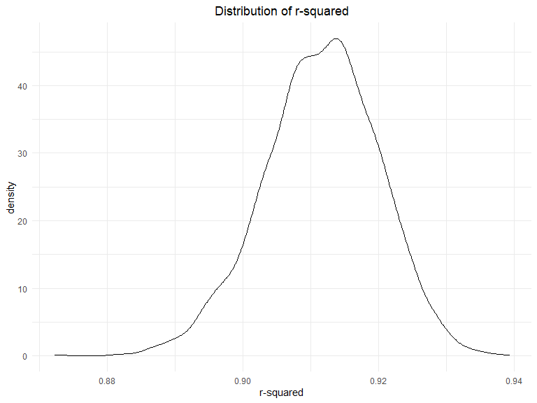

p8105_hw6_yf2605
================

## Problem 1

Download data

``` r
weather_df = 
  rnoaa::meteo_pull_monitors(
    c("USW00094728"),
    var = c("PRCP", "TMIN", "TMAX"), 
    date_min = "2017-01-01",
    date_max = "2017-12-31") %>%
  mutate(
    name = recode(id, USW00094728 = "CentralPark_NY"),
    tmin = tmin / 10,
    tmax = tmax / 10) %>%
  select(name, id, everything())
```

    ## Registered S3 method overwritten by 'hoardr':
    ##   method           from
    ##   print.cache_info httr

    ## using cached file: C:\Users\hzlyz\AppData\Local/Cache/R/noaa_ghcnd/USW00094728.dly

    ## date created (size, mb): 2022-11-26 12:09:42 (8.443)

    ## file min/max dates: 1869-01-01 / 2022-11-30

Function calculates log beta0 \* beta1

``` r
log_betas_fuc = function(model){
  
  estimate_df = 
    broom::tidy(model) %>% 
    select(term, estimate) %>% 
    pivot_wider(
      names_from = term,
      values_from = estimate
    ) %>% 
    janitor::clean_names() %>% 
    mutate(log_betas = log(intercept*tmin))

  estimate_df[["log_betas"]]
}
```

Function gets r squared

``` r
r_squared_fuc = function(model){
  
  r_squared_df = 
    broom::glance(model) %>% 
    janitor::clean_names()

  r_squared_df[["r_squared"]]
}
```

Generate data frame for plot

``` r
models_df =   
  weather_df %>% 
  bootstrap(n = 5000) %>% 
  mutate(
    model = map(strap, ~lm(tmax ~ tmin, data = .x)),
    log_betas = as.numeric(map(model, log_betas_fuc)),
    r_squared = as.numeric(map(model, r_squared_fuc))
  ) %>% 
  select(log_betas, r_squared)
```

### Distribution of log (beta0 \* beta1)

``` r
models_df %>% 
  ggplot(aes(x = log_betas)) +
  geom_density() +
  labs(
    title = "Distribution of log (beta0 * beta1)",
    x = "log beta0 * beta1",
  )
```


The distribution of log (beta0 \* beta1) is approximately normal with
mean about 2.01.

### Distribution of r-squared

``` r
models_df %>% 
  ggplot(aes(x = r_squared)) +
  geom_density() +
  labs(
    title = "Distribution of r-squared",
    x = "r-squared",
  )
```



The distribution of r-squared is approximately normal with mean about
0.912.

### 95% confidence interval

``` r
log_betas_ci = quantile(models_df[["log_betas"]], probs = c(0.025, 0.975))

r_squared_ci = quantile(models_df[["r_squared"]], probs = c(0.025, 0.975))
```

The 95% CI for log (beta0 \* beta1) is (1.9637996, 2.0593373)

The 95% CI for r-squared is (0.8936994, 0.9272501)

## Problem 2

- Create a city_state variable
- Create a binary variable indicating whether the homicide is solved
- Omit cities Dallas, TX; Phoenix, AZ; Kansas City, MO;Tulsa, AL
- filter victim_race white or black.
- convert victim_age to numeric, unknown is converted to NA

``` r
homicide = 
  read_csv("data/homicide-data.csv") %>% 
  mutate(
    city_state = str_c(city, ", ", state),
    solved = ifelse(disposition == "Closed without arrest" | 
                     disposition == "Open/No arrest", 0, 1),
    victim_age = as.numeric(victim_age)
  ) %>% 
  filter(!(city_state %in% c("Dallas, TX", 
                             "Phoenix, AZ", 
                             "Kansas City, MO", 
                             "Tulsa, AL"))) %>% 
  filter(victim_race %in% c("White", "Black"))
```

    ## Rows: 52179 Columns: 12
    ## ── Column specification ────────────────────────────────────────────────────────
    ## Delimiter: ","
    ## chr (9): uid, victim_last, victim_first, victim_race, victim_age, victim_sex...
    ## dbl (3): reported_date, lat, lon
    ## 
    ## ℹ Use `spec()` to retrieve the full column specification for this data.
    ## ℹ Specify the column types or set `show_col_types = FALSE` to quiet this message.

**For the city of Baltimore, MD, use the glm function to fit a logistic
regression with resolved vs unresolved as the outcome and victim age,
sex and race as predictors. Save the output of glm as an R object;apply
the broom::tidy to this object;and obtain the estimate and confidence
interval of the adjusted odds ratio for solving homicides comparing male
victims to female victims keeping all other variables fixed.**

``` r
baltimore_data = homicide %>% 
  filter(city_state == "Baltimore, MD") 

baltimore_logistic = glm(
  solved ~ victim_age + victim_sex + victim_race,
  family=binomial(link='logit'), 
  data = baltimore_data
  )

baltimore_est = 
  broom::tidy(baltimore_logistic, conf.int = TRUE) %>% 
  mutate(
    odds_ratio = exp(estimate),
    low = exp(conf.low),
    high = exp(conf.high)
  ) %>% 
  filter(term == "victim_sexMale") %>% 
  select(odds_ratio, low, high)
```

The adjusted odds ratio for solving homicides comparing male victims to
female victims keeping all other variables fixed is estimated to be
0.4255117, with 95% confidence interval (0.3241908, 0.5575508)

**Now run glm for each of the cities in your dataset, and extract the
adjusted odds ratio (and CI) for solving homicides comparing male
victims to female victims. Do this within a “tidy” pipeline, making use
of purrr::map, list columns, and unnest as necessary to create a
dataframe with estimated ORs and CIs for each city.**

``` r
odds_ratio_fuc = function(model){
  
  df = 
    broom::tidy(model, conf.int = TRUE) %>% 
    mutate(
      odds_ratio = exp(estimate),
      low = exp(conf.low),
      high = exp(conf.high)
    ) %>% 
    filter(term == "victim_sexMale") %>% 
    select(odds_ratio, low, high)

  df
}  

victim_sex_est = 
  homicide %>% 
  select(solved, victim_age, victim_sex, victim_race, city_state) %>% 
  nest(data = c(solved, victim_age, victim_sex, victim_race)) %>% 
  mutate(
    model  = map(data, ~glm(solved ~ victim_age + victim_sex + victim_race, 
                            family=binomial(link='logit'),
                            data = .x)),
    odds_ratios = map(model, odds_ratio_fuc)
  ) %>% 
  unnest(odds_ratios) %>% 
  select(-model, -data)

victim_sex_est
```

    ## # A tibble: 47 × 4
    ##    city_state      odds_ratio   low  high
    ##    <chr>                <dbl> <dbl> <dbl>
    ##  1 Albuquerque, NM      1.77  0.825 3.76 
    ##  2 Atlanta, GA          1.00  0.680 1.46 
    ##  3 Baltimore, MD        0.426 0.324 0.558
    ##  4 Baton Rouge, LA      0.381 0.204 0.684
    ##  5 Birmingham, AL       0.870 0.571 1.31 
    ##  6 Boston, MA           0.674 0.353 1.28 
    ##  7 Buffalo, NY          0.521 0.288 0.936
    ##  8 Charlotte, NC        0.884 0.551 1.39 
    ##  9 Chicago, IL          0.410 0.336 0.501
    ## 10 Cincinnati, OH       0.400 0.231 0.667
    ## # … with 37 more rows

**Create a plot that shows the estimated ORs and CIs for each city.
Organize cities according to estimated OR, and comment on the plot.**

``` r
victim_sex_est %>% 
  mutate(city_state = fct_reorder(city_state, odds_ratio)) %>% 
  ggplot(aes(x = city_state, y=odds_ratio)) +
  geom_point() +
  geom_errorbar(aes(ymin = low, 
                    ymax = high
                  ))+
  labs(
    title = "ORs and CIs for each city",
    y = "Odds Ratio",
    x = "City, State"
  )+
  theme(axis.text.x = element_text(angle = 90))
```


- Most cities have an adjusted odds ratio for solving homicides
  comparing male victims to female victims lower than 1.
- Odds ratio higher than 1 are all non-significant.

## Problem 3

In this problem, you will analyze data gathered to understand the
effects of several variables on a child’s birthweight. This dataset,
available here, consists of roughly 4000 children and includes the
following variables:

babysex: baby’s sex (male = 1, female = 2) bhead: baby’s head
circumference at birth (centimeters) blength: baby’s length at birth
(centimeteres) bwt: baby’s birth weight (grams) delwt: mother’s weight
at delivery (pounds) fincome: family monthly income (in hundreds,
rounded) frace: father’s race (1 = White, 2 = Black, 3 = Asian, 4 =
Puerto Rican, 8 = Other, 9 = Unknown) gaweeks: gestational age in weeks
malform: presence of malformations that could affect weight (0 = absent,
1 = present) menarche: mother’s age at menarche (years) mheigth:
mother’s height (inches) momage: mother’s age at delivery (years) mrace:
mother’s race (1 = White, 2 = Black, 3 = Asian, 4 = Puerto Rican, 8 =
Other) parity: number of live births prior to this pregnancy pnumlbw:
previous number of low birth weight babies pnumgsa: number of prior
small for gestational age babies ppbmi: mother’s pre-pregnancy BMI ppwt:
mother’s pre-pregnancy weight (pounds) smoken: average number of
cigarettes smoked per day during pregnancy wtgain: mother’s weight gain
during pregnancy (pounds) Load and clean the data for regression
analysis (i.e. convert numeric to factor where appropriate, check for
missing data, etc.).

Propose a regression model for birthweight. This model may be based on a
hypothesized structure for the factors that underly birthweight, on a
data-driven model-building process, or a combination of the two.
Describe your modeling process and show a plot of model residuals
against fitted values – use add_predictions and add_residuals in making
this plot.

Compare your model to two others:

One using length at birth and gestational age as predictors (main
effects only) One using head circumference, length, sex, and all
interactions (including the three-way interaction) between these Make
this comparison in terms of the cross-validated prediction error; use
crossv_mc and functions in purrr as appropriate.

Note that although we expect your model to be reasonable, model building
itself is not a main idea of the course and we don’t necessarily expect
your model to be “optimal”.
